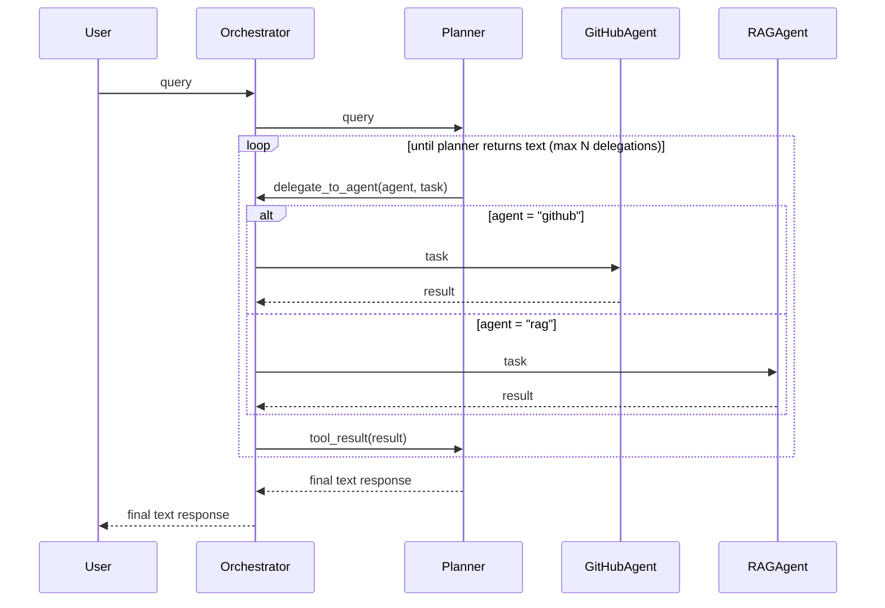

# Architecture

## Table of Contents

- [Orchestration](#orchestration)
- [RAG Pipeline](#rag-pipeline)
- [Indexing Lifecycle](#indexing-lifecycle)
- [Persistence](#persistence)
- [Multi-Provider Support](#multi-provider-support)

## Orchestration

### Sequence Diagram

### Component Responsibilities

| Component | Owns | Does NOT do |
| --- | --- | --- |
| **Orchestrator** | Outer loop, agent registry, delegation routing, loop protection | LLM calls, tool execution |
| **Planner** | Reasoning, task decomposition, synthesis | MCP tool calls, RAG retrieval |
| **GitHubAgent** | GitHub MCP tools, repo queries, on-demand file indexing | Planning, synthesis |
| **RAGAgent** | Hybrid retrieval, reranking, codebase Q&A | Planning, MCP tool calls |

## RAG Pipeline

Query flow: chunk → embed → hybrid search (vector + BM25 via RRF) → optional rerank → top-k context.

| Stage | Component | Notes |
| --- | --- | --- |
| Chunk & Embed | `chunker.py`, `VoyageEmbedder` | Splits fetched content into chunks, embeds with VoyageAI |
| Hybrid Search | `HybridRetriever` | Vector index + `BM25Index`, merged via Reciprocal Rank Fusion (RRF) |
| Rerank (optional) | `VoyageReranker` | Cross-encoder narrows RRF candidates to the most relevant few |

## Indexing Lifecycle

Files are indexed lazily, not eagerly, to avoid embedding an entire repo upfront.

- **On-demand indexing** — `GitHubAgent` indexes a file the first time the LLM fetches it via MCP. Each chunk is tagged with a `file_key`, so already-indexed files are skipped on refetch.
- **`/clear-cache`** — `DocumentIndexer` drops all chunks for the active repo from the vector store. The next file fetch re-indexes from scratch.
- **Startup sync** — `DocumentIndexer` rebuilds the in-memory BM25 index from the vector store on boot, so restarts don't re-embed (and re-bill) existing content.

## Persistence

| Layer | Backend | Lifetime |
| --- | --- | --- |
| Vector index | `QdrantVectorIndex` (default) or `ChromaVectorIndex`, selected via `VECTOR_STORE` config | Persistent — source of truth for indexed chunks |
| Keyword index | `BM25Index` | In-memory only — rebuilt from the vector store on startup |

Both vector backends implement `BaseVectorIndex`, so `HybridRetriever` and `DocumentIndexer` are backend-agnostic.

## Multi-Provider Support

| Piece | Role |
| --- | --- |
| `ChatClientProtocol` | Common interface for chat, streaming, and message formatting across providers |
| `Claude` / `Gemini` | Provider-specific implementations (Anthropic SDK / Google GenAI SDK) |
| `create_chat_client` | Factory that picks a provider from `Config.provider` (`anthropic` default, or `gemini`) |
| `MessageStream` | Per-provider streaming protocol so the orchestrator loop stays provider-agnostic |
