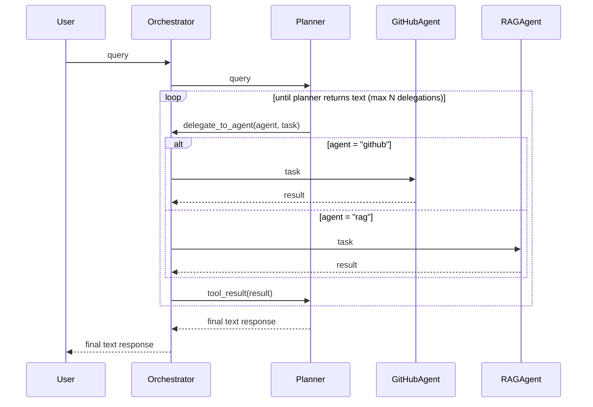

# Architecture

## Table of Contents

- [Core Flow](#core-flow)
  - [Orchestration](#orchestration)
  - [MCP Integration](#mcp-integration)
  - [Tool Use Loop](#tool-use-loop)
  - [RAG Pipeline](#rag-pipeline)
- [Data Layer](#data-layer)
  - [Indexing Lifecycle](#indexing-lifecycle)
  - [Persistence](#persistence)
- [Cross-cutting Concepts](#cross-cutting-concepts)
  - [Multi-Provider Support](#multi-provider-support)
  - [Streaming](#streaming)
  - [Observability](#observability)
  - [Error Handling](#error-handling)
- [Quality](#quality)
  - [Evaluation Pipeline](#evaluation-pipeline)

## Core Flow

### Orchestration

#### Sequence Diagram

#### Component Responsibilities

| Component | Owns | Does NOT do |
| --- | --- | --- |
| **Orchestrator** | Outer loop, agent registry, delegation routing, loop protection | LLM calls, tool execution |
| **Planner** | Reasoning, task decomposition, synthesis | MCP tool calls, RAG retrieval |
| **GitHubAgent** | GitHub MCP tools, repo queries, on-demand file indexing | Planning, synthesis |
| **RAGAgent** | Hybrid retrieval, reranking, codebase Q&A | Planning, MCP tool calls |

The active repository is passed as typed data through the orchestrator, automatically scoping prompts and tool calls to that repo.

### MCP Integration

MCP (Model Context Protocol) servers run as subprocesses, connected via stdio. The system can register multiple MCP clients (e.g., GitHub).

On startup, tools are fetched from all connected servers. When the LLM requests a tool call, the system finds the right MCP client and dispatches the request. If a tool isn't found, an error is returned to the LLM so it can retry or respond gracefully.

### Tool Use Loop

Agents run an agentic loop: send a query to the LLM, check if it wants to call tools, execute the tools, feed results back, repeat until the LLM returns a text response.

The loop exits when:

- The LLM responds with text (no tool calls)
- Max tool iterations is reached (prevents runaway loops)
- An unrecoverable error occurs

This lets agents gather information across multiple tool calls before synthesizing a final answer.

### RAG Pipeline

Query flow: chunk → embed → hybrid search (vector + BM25 via RRF) → optional rerank → top-k context.

| Stage | Component | Notes |
| --- | --- | --- |
| Chunk & Embed | `chunker.py`, `VoyageEmbedder` | Splits fetched content into chunks, embeds with VoyageAI |
| Hybrid Search | `HybridRetriever` | Vector index + `BM25Index`, merged via Reciprocal Rank Fusion (RRF) |
| Rerank (optional) | `VoyageReranker` | Cross-encoder narrows RRF candidates to the most relevant few |

## Data Layer

### Indexing Lifecycle

Files are indexed lazily, not eagerly, to avoid embedding an entire repo upfront.

- **On-demand indexing** — `GitHubAgent` indexes a file the first time the LLM fetches it via MCP. Each chunk is tagged with a `file_key`, so already-indexed files are skipped on refetch.
- **`/clear-cache`** — `DocumentIndexer` drops all chunks for the active repo from the vector store. The next file fetch re-indexes from scratch.
- **Startup sync** — `DocumentIndexer` rebuilds the in-memory BM25 index from the vector store on boot, so restarts don't re-embed (and re-bill) existing content.

### Persistence

| Layer | Backend | Lifetime |
| --- | --- | --- |
| Vector index | `QdrantVectorIndex` (default) or `ChromaVectorIndex`, selected via `VECTOR_STORE` config | Persistent — source of truth for indexed chunks |
| Keyword index | `BM25Index` | In-memory only — rebuilt from the vector store on startup |

Both vector backends implement `BaseVectorIndex`, so `HybridRetriever` and `DocumentIndexer` are backend-agnostic.

## Cross-cutting Concepts

### Multi-Provider Support

| Piece | Role |
| --- | --- |
| `ChatClientProtocol` | Common interface for chat, streaming, and message formatting across providers |
| `Claude` / `Gemini` | Provider-specific implementations (Anthropic SDK / Google GenAI SDK) |
| `create_chat_client` | Factory that picks a provider from `Config.provider` (`anthropic` default, or `gemini`) |
| `MessageStream` | Per-provider streaming protocol so the orchestrator loop stays provider-agnostic |

### Streaming

Responses stream token-by-token from the LLM to the caller (CLI or Chainlit).

Claude and Gemini SDKs send stream data in different formats. Each provider normalizes these into a common chunk format, so the rest of the app doesn't need to know which LLM is running.

The caller provides a callback that handles each text chunk as it arrives.

### Observability

Every query carries a `query_id` (8-char UUID) so logs can be traced end-to-end across orchestrator, agents, and providers. Logs are structured via structlog.

Key metrics tracked per request:

- `input_tokens`, `output_tokens`: cost visibility
- `cache_read_input_tokens`, `cache_creation_input_tokens`: prompt caching effectiveness

### Error Handling

Rate limits (429) are retried with exponential backoff, respecting the provider's retry-after when present.

- Max retries: 3
- Backoff: `2^retries` seconds (or provider's retry-after)
- On exhaustion: user-friendly message instead of crash

## Quality

### Evaluation Pipeline

Two eval pipelines measure system quality: RAG eval (retrieval + answer quality) and Prompt eval (routing correctness).

#### RAG Eval

Measures retrieval quality and answer faithfulness against a golden dataset.

| Metric | What it measures | How |
| --- | --- | --- |
| Section Precision | % of retrieved chunks that were expected | `retrieved ∩ expected / retrieved` |
| Section Recall | % of expected chunks that were retrieved | `retrieved ∩ expected / expected` |
| Keyword Recall | % of expected keywords found in retrieved content | Substring match |
| Faithfulness | Is the answer grounded in the context? | LLM-as-judge: `grounded / partial / hallucinated` |

Flow: load fixture → chunk & embed → run eval cases → compute metrics → print summary.

#### Prompt Eval

Measures whether prompts produce correct routing decisions (e.g., planner delegates to the right agent).

| Stage | What happens |
| --- | --- |
| Run prompt | Send prompt + test input to LLM with tools wired |
| Extract routing | Check which agent (if any) was called via `tool_calls` |
| Grade | Compare `actual` agent to `expected_agent` from test case |

Deterministic grading: pass if `actual == expected`, fail otherwise. No LLM judgment needed since it's an objective check.

#### Shared Patterns

Cross-cutting concerns that both eval pipelines share.

- **Structured output** — LLM responses are parsed into Pydantic models with self-correction on validation failure
- **Rate limit handling** — retry loop with exponential backoff for Anthropic/Gemini rate limits
- **Golden datasets** — hand-curated test cases in `*_eval_dataset.py` files
