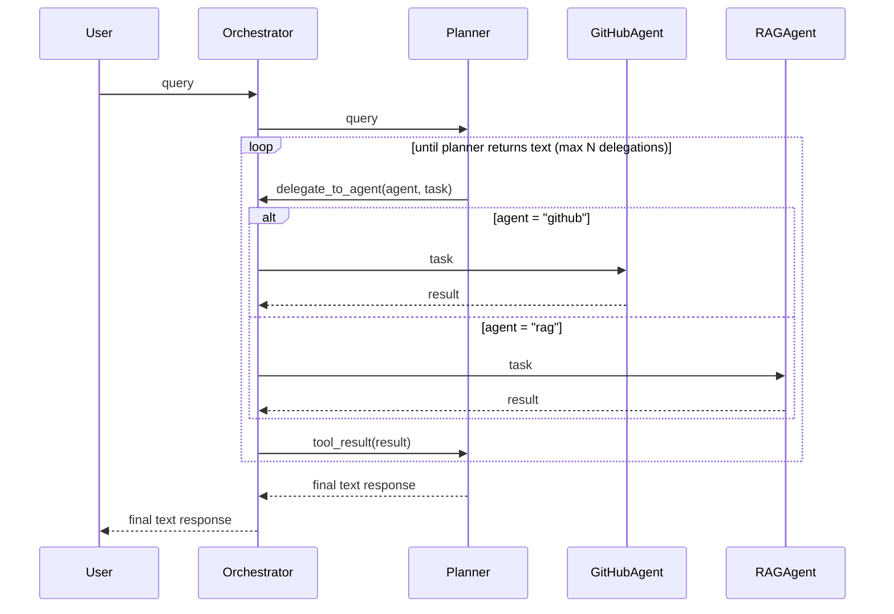

# Agent Orchestrator Design

## Sequence Diagram

## Component Responsibilities

| Component | Owns | Does NOT do |
|---|---|---|
| **Orchestrator** | Outer loop, agent registry, delegation routing, loop protection | LLM calls, tool execution |
| **Planner** | Reasoning, task decomposition, synthesis | MCP tool calls, RAG retrieval |
| **GitHubAgent** | GitHub MCP tools, repo queries | Planning, synthesis |
| **RAGAgent** | Hybrid retrieval, reranking, codebase Q&A | Planning, MCP tool calls |
